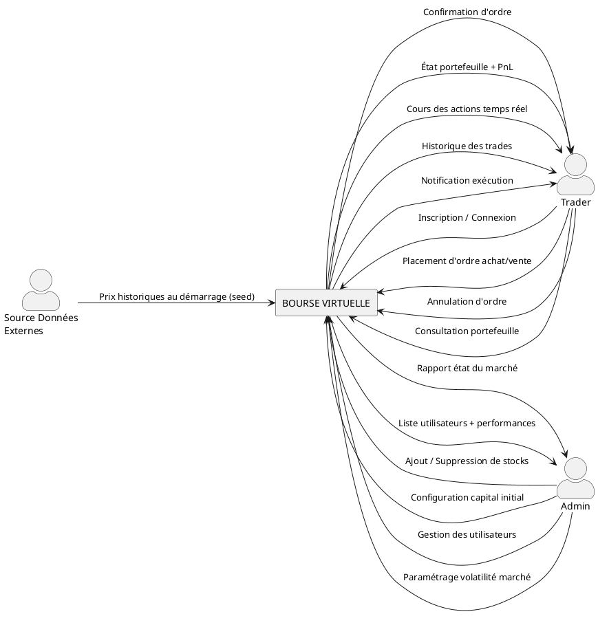
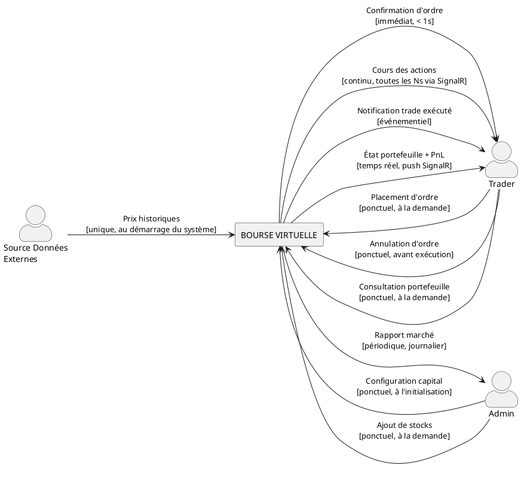
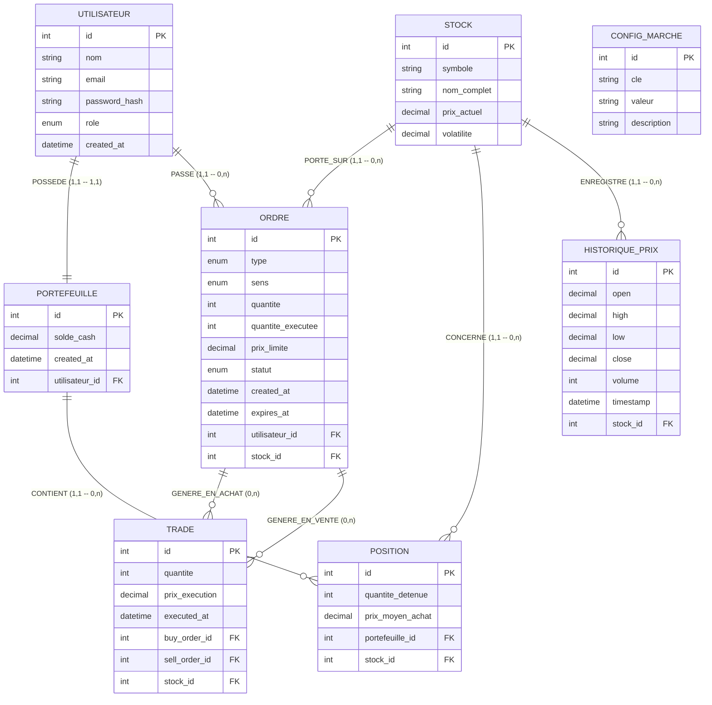
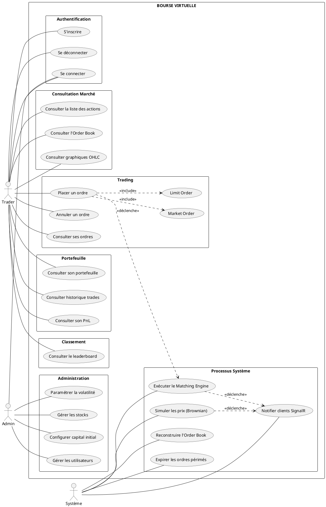
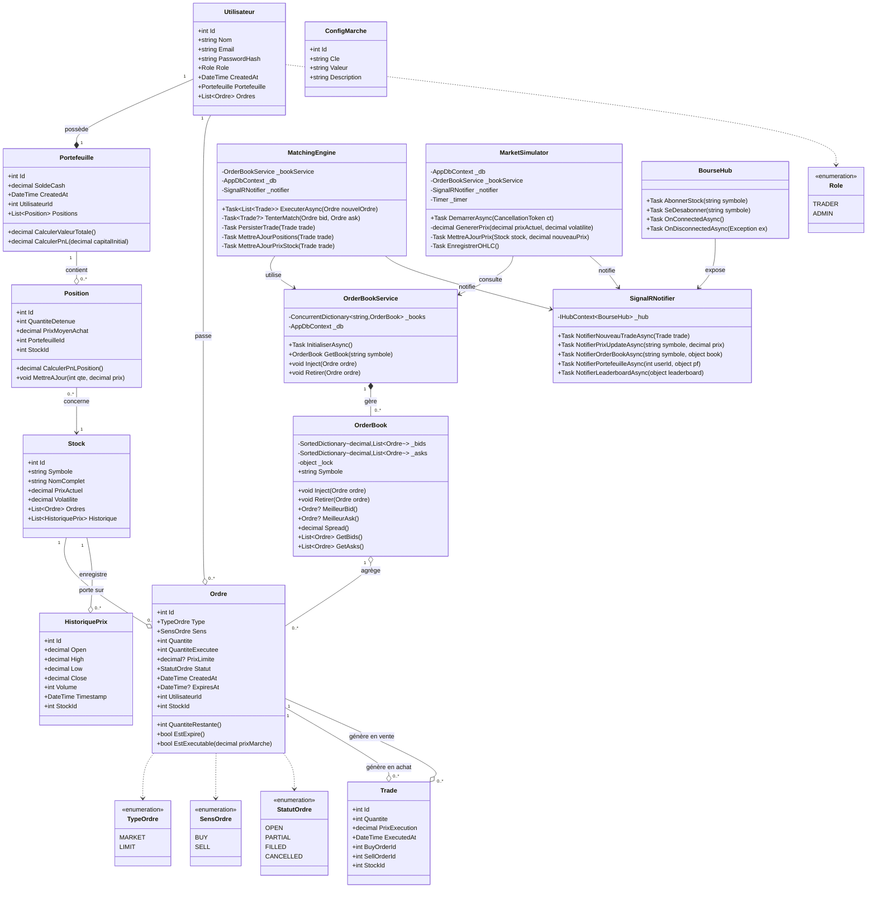
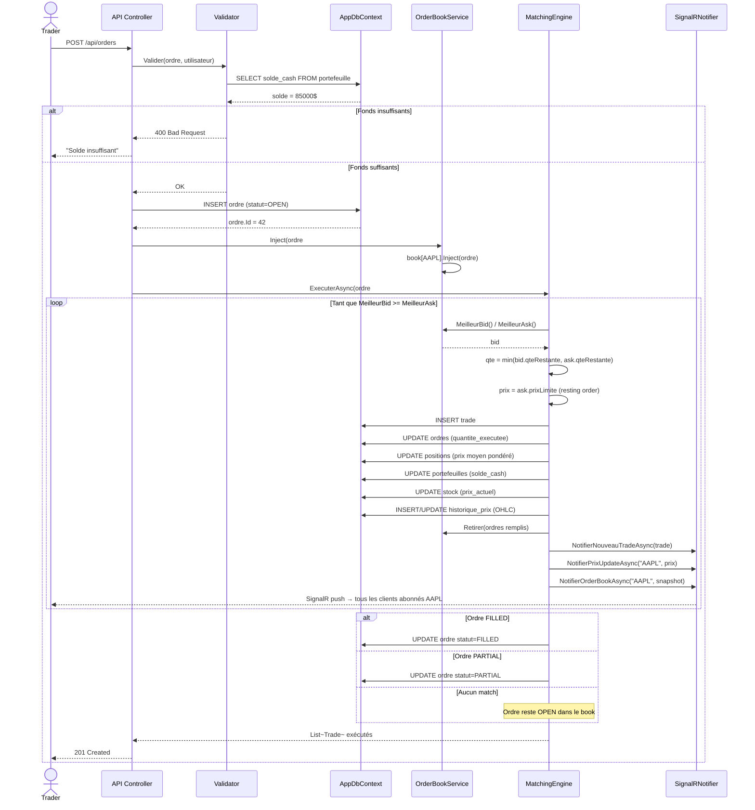
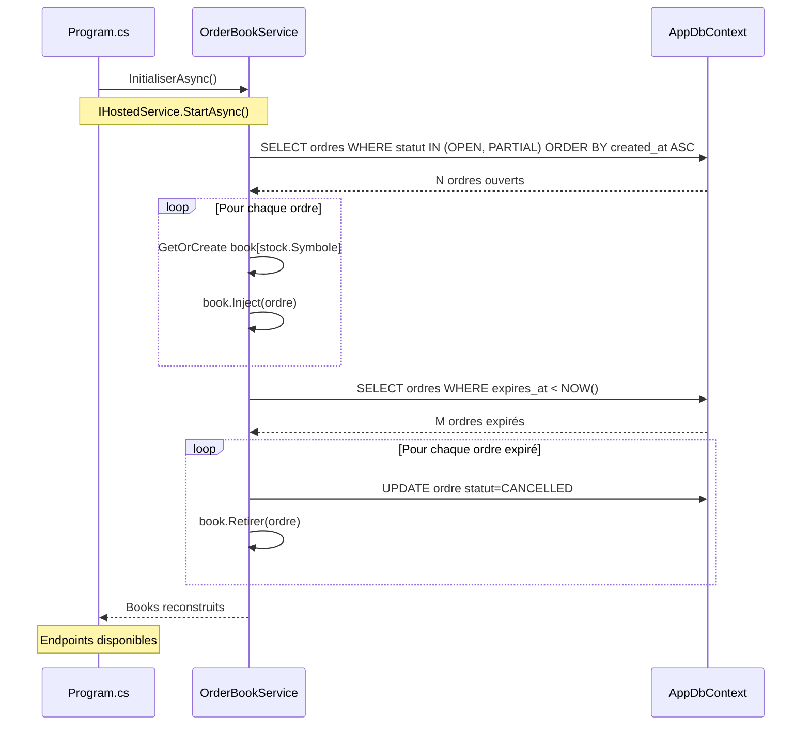
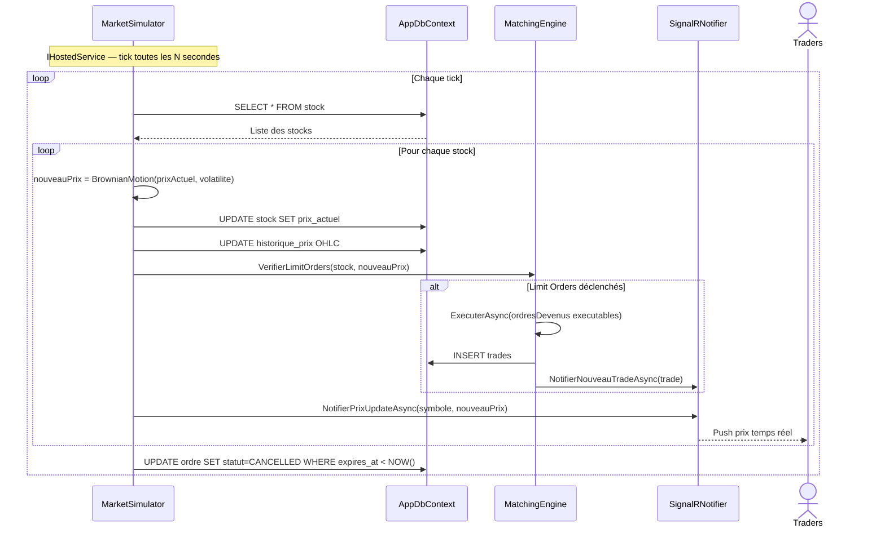

# 🏦 Bourse Virtuelle — Documentation Complète du Projet

> **Projet académique — ENI Fianarantsoa**  
> Stack : ASP.NET Core 8 · EF Core · SQLite/PostgreSQL · SignalR · React (JS/TS)  
> Équipe : 4 personnes · Durée : 4 semaines

---

## Table des matières

1. [Notions fondamentales](#1-notions-fondamentales)
2. [Périmètre du projet](#2-périmètre-du-projet)
3. [Stack technique](#3-stack-technique)
4. [Méthodes de travail](#4-méthodes-de-travail)
5. [Répartition des tâches](#5-répartition-des-tâches)
6. [Planning 4 semaines](#6-planning-4-semaines)
7. [Conception — Merise](#7-conception--merise)
8. [Conception — UML](#8-conception--uml)
9. [Architecture applicative](#9-architecture-applicative)
10. [API REST — Endpoints](#10-api-rest--endpoints)
11. [Temps réel — SignalR](#11-temps-réel--signalr)
12. [Persistance — Stratégie RAM + Disque](#12-persistance--stratégie-ram--disque)
13. [Structure solution .NET](#13-structure-solution-net)
14. [Données — Seed et simulation](#14-données--seed-et-simulation)
15. [Git — Stratégie, Workflow et Communication](#15-git--stratégie-workflow-et-communication)
16. [Intégration — Stratégie sans Docker](#16-intégration--stratégie-sans-docker)
17. [Références et inspirations](#17-références-et-inspirations)

---

## 1. Notions fondamentales

### 1.1 Qu'est-ce qu'une bourse ?

Une bourse est un **marché de rencontre entre acheteurs et vendeurs** d'actifs financiers. Le prix d'un actif n'est pas fixé arbitrairement : il **émerge** de la confrontation des ordres d'achat et de vente. C'est le mécanisme central que ce projet doit reproduire.

---

### 1.2 L'Order Book (Carnet d'ordres)

C'est le cœur du système. Tout tourne autour de lui.

```
╔══════════════════════════════════╗
║         ORDER BOOK : AAPL        ║
╠══════════════╦═══════════════════╣
║   BID (achat)║   ASK (vente)     ║
║ Qty │ Price  ║ Price │ Qty       ║
╠═════╪════════╬═══════╪═══════════╣
║ 100 │ 149.50 ║ 150.00│ 200       ║
║  50 │ 149.00 ║ 150.50│ 150       ║
║ 200 │ 148.50 ║ 151.00│ 300       ║
╚═════╧════════╩═══════╧═══════════╝
         SPREAD = 0.50
```

| Terme | Définition |
|---|---|
| **BID** | Ce que les acheteurs sont prêts à payer — trié **décroissant** |
| **ASK** | Ce que les vendeurs demandent — trié **croissant** |
| **SPREAD** | Écart entre le meilleur BID et le meilleur ASK |
| **Trade** | Exécution quand BID ≥ ASK |
| **Depth** | Volume disponible à chaque niveau de prix |

---

### 1.3 Le Matching Engine

L'algorithme qui **exécute les trades** quand bid ≥ ask.

**Règle : Price-Time Priority**
> *Le meilleur prix d'abord. À prix égal, le plus ancien ordre est prioritaire.*

```
Exemple :
→ Alice : BUY  100 actions @ 150.00$
→ Bob   : SELL 100 actions @ 149.50$
→ Bid (150.00) ≥ Ask (149.50) → MATCH !
→ Prix d'exécution = 149.50$ (prix du resting order = ASK)
→ Les deux ordres disparaissent du book
```

Pseudocode du matching engine :

```
while meilleurBid.prix >= meilleurAsk.prix :
    qte = min(bid.quantiteRestante, ask.quantiteRestante)
    executer_trade(bid, ask, qte, prix=ask.prixLimite)
    mettre_a_jour_book()
    notifier_clients_signalr()
```

---

### 1.4 Types d'ordres

| Type | Comportement |
|---|---|
| **Market Order** | Exécution immédiate au meilleur prix disponible. Pas de prix limite. |
| **Limit Order** | Exécution uniquement si le prix atteint le seuil défini. Reste dans le book sinon. |
| **Stop Order** *(N3)* | Déclenché quand le prix dépasse un seuil — crée alors un Market Order. |

---

### 1.5 Concepts financiers clés

**P&L (Profit & Loss)**
```
PnL = Valeur actuelle du portefeuille - Capital initial
PnL% = (PnL / Capital initial) × 100
```

**Prix moyen d'achat (Average Cost Basis)**
```
Quand on achète plusieurs fois le même stock à des prix différents :
PrixMoyen = (QteActuelle × PrixMoyenActuel + NouvelleQte × NouveauPrix)
            / (QteActuelle + NouvelleQte)
```

**OHLC (Candlestick)**
```
Open  = Prix à l'ouverture de la période
High  = Prix le plus haut de la période
Low   = Prix le plus bas de la période
Close = Prix à la clôture de la période
Volume= Nombre d'actions échangées sur la période
```

**Mouvement Brownien Géométrique (Brownian Motion)**

Modèle mathématique utilisé pour simuler des prix réalistes :
```
dS = S × (μ dt + σ √dt × ε)
où :
  S  = prix actuel
  μ  = drift (tendance — souvent 0 en simulation neutre)
  σ  = volatilité (ex: 0.015 = 1.5% par jour)
  ε  = choc gaussien aléatoire (Box-Muller transform)
```

En C# :
```csharp
double u1 = 1.0 - Random.Shared.NextDouble();
double u2 = 1.0 - Random.Shared.NextDouble();
double gaussien = Math.Sqrt(-2.0 * Math.Log(u1))
                * Math.Sin(2.0 * Math.PI * u2); // Box-Muller
double dt = 1.0 / (252 * 390); // 1 tick parmi les minutes de trading annuelles
double choc = volatilite * Math.Sqrt(dt) * gaussien;
decimal nouveauPrix = prixActuel * (decimal)Math.Exp(choc);
```

---

## 2. Périmètre du projet

### ✅ Niveau 1 — Obligatoire (MVP)

- Inscription / Connexion (JWT)
- Portefeuille virtuel (capital configurable par Admin)
- Liste des actions + prix actuel
- **Market Order** + **Limit Order**
- **Matching Engine** + **Order Book**
- Historique des transactions
- Reconstruction du book au redémarrage

### 🟡 Niveau 2 — Recommandé

- Annulation d'ordre
- Consultation des ordres en cours
- Affichage Bid / Ask / Spread en temps réel
- SignalR — mise à jour live (book, prix, portefeuille)
- Expiration des Limit Orders (GTD — Good Till Date)

### 🔵 Niveau 3 — Excellent

- Graphiques candlesticks OHLC (React + Chart.js / ApexCharts)
- P&L par position + P&L global
- Leaderboard des traders

### ❌ Hors scope — Ne pas toucher

| Feature | Pourquoi coupée |
|---|---|
| ML.NET / prédiction de prix | Projet de fin d'études à part entière |
| Actualités simulées | Theming sans valeur technique |
| Options / Futures / Dérivés | Implique Black-Scholes, greeks, pricing quantitatif |
| Multi-devise | Complexité inutile pour le jury |
| Short selling / Levier | Finance avancée hors périmètre |
| Trading haute fréquence | Hors scope académique |
| Stop Order | Déprioritisé — nécessite un price watcher background dédié |
| OCO / Bracket orders | Gestion d'état couplé entre ordres = projet parallèle |

---

## 3. Stack technique

### Backend

| Technologie | Rôle |
|---|---|
| **ASP.NET Core 8** | Web API REST |
| **Entity Framework Core** | ORM — accès base de données |
| **SQLite** | Base de données développement local |
| **PostgreSQL** | Base de données démo / production |
| **SignalR** | Temps réel WebSocket |
| **JWT Bearer** | Authentification stateless |
| **BCrypt.Net** | Hachage des mots de passe |
| **xUnit + FluentAssertions + Moq** | Tests unitaires |

### Frontend

| Technologie | Rôle |
|---|---|
| **React (JS ou TS)** | Interface utilisateur |
| **Chart.js ou ApexCharts** | Graphiques OHLC + prix |
| **@microsoft/signalr** | Client SignalR |

### Stratégie base de données

```
Dev local    → SQLite  (fichier bourse.db, zéro config)
Démo / Prod  → PostgreSQL (serveur partagé ou Docker)
```

EF Core abstrait le moteur. Le switch se fait en **une ligne** dans `Program.cs` :

```csharp
// Dev
opt.UseSqlite("Data Source=bourse.db");

// Prod
opt.UseNpgsql(connectionString);
```

---

## 4. Méthodes de travail

### Merise — pour la base de données
Utilisé pour la modélisation des données : MCD → MLD → MPD.

### UML — pour l'architecture applicative
Utilisé pour modéliser le comportement et la structure du code.

### Agile allégé (Scrum sans le cérémonial)

**Ce qu'on garde :**
- Sprints d'une semaine (4 sprints = 4 semaines)
- Daily standup 10 minutes : *"J'ai fait / je fais / je suis bloqué"*
- Backlog priorisé par dépendance technique
- Definition of Done : codé + testé + mergé

**Ce qu'on jette :**
- Story points
- Planning Poker
- User Stories formelles
- Sprint Reviews formelles

---

## 5. Répartition des tâches

### Division Back / Front

```
Membre 1  → Backend pur  (Core algorithmique)
Membre 2  → Backend pur  (Auth, Infrastructure, SignalR backend)
Membre 3  → Backend pur  (Simulateur, API Marché)
Membre 4  → Frontend pur (React complet)
```

**Le risque :** 1 personne seule sur tout le frontend c'est beaucoup.  
**La compensation :**
- Membre 2 aide Membre 4 en **semaine 3** sur l'intégration SignalR côté React — il a codé le hub backend, il connaît exactement les events émis
- Membre 3 aide Membre 4 sur les **pages simples** (StockList, AdminPage) si son simulateur est terminé en semaine 2

---

### Principe d'équité

L'équité n'est pas en **lignes de code** mais en **temps passé**. Chaque membre vise 40-50h sur 4 semaines. Les complexités sont différentes par nature :

```
Membre 1  → peu de code, très complexe algorithmiquement
Membre 4  → beaucoup de code, complexité d'intégration
Membre 2/3 → volume et complexité moyens
```

---

### Membre 1 — Core algorithmique

**Owner exclusif de :**
```
VirTrade.Core/
├── Entities/        ← TOUTES les entités (personne d'autre n'y touche)
├── Enums/           ← TOUS les enums
├── Interfaces/      ← TOUTES les interfaces
└── Services/
    ├── OrderBook.cs
    ├── OrderBookService.cs
    └── MatchingEngine.cs

VirTrade.API/Controllers/
└── OrdersController.cs
```

**Responsabilités :**
- Toutes les entités métier + enums + interfaces en semaine 1 — **priorité absolue**
- `OrderBook` — structure `SortedDictionary` + lock granulaire par ticker
- `OrderBookService` — `ConcurrentDictionary`, reconstruction au boot
- `MatchingEngine` — algorithme Price-Time Priority, partial fills, persistance trades
- `OrdersController` — placer, annuler, consulter les ordres
- Calcul P&L par position

**Ne touche jamais :**
- `Program.cs`
- `AppDbContext.cs`
- Tout fichier frontend

---

### Membre 2 — Auth + Infrastructure + Intégration

**Owner exclusif de :**
```
VirTrade.Infrastructure/Persistence/
└── AppDbContext.cs       ← OWNER EXCLUSIF

VirTrade.API/
├── Program.cs            ← OWNER EXCLUSIF
├── Controllers/
│   ├── AuthController.cs
│   └── PortfolioController.cs
└── Hubs/
    └── BourseHub.cs      ← implémentation backend SignalR

VirTrade.Infrastructure/Notifications/
└── SignalRNotifier.cs
```

**Responsabilités :**
- `AppDbContext` — DbSets, Fluent API, configurations, seed data
- `Program.cs` — enregistrement de tous les services (les autres lui soumettent leurs services via PR)
- Auth JWT — inscription, connexion, middleware, rôles
- `PortfolioController` — portefeuille, positions, historique, PnL global
- `BourseHub` — groupes SignalR, abonnements par ticker
- `SignalRNotifier` — toutes les notifications temps réel
- `LeaderboardController` — classement par valeur totale de portefeuille

**Ne touche jamais :**
- `Core/` (lecture seule)
- Fichiers frontend

---

### Membre 3 — Simulateur + API Marché + Admin

**Owner exclusif de :**
```
VirTrade.Core/Services/
└── MarketSimulator.cs

VirTrade.API/Controllers/
├── StocksController.cs
└── AdminController.cs
```

**Responsabilités :**
- `MarketSimulator` — Brownian motion, tick background (`IHostedService`)
- Vérification des Limit Orders déclenchés à chaque tick
- Enregistrement OHLC dans `HistoriquePrix`
- `StocksController` — liste, détail, order book snapshot, historique OHLC
- `AdminController` — gestion stocks, config marché, gestion users
- Seed des données historiques (Alpha Vantage)
- Expiration automatique des ordres périmés

**Ne touche jamais :**
- `AppDbContext.cs` directement — soumet ses DbSets à Membre 2 via PR
- `Program.cs` directement — soumet ses services à Membre 2
- Fichiers frontend

---

### Membre 4 — React complet

**Owner exclusif de :**
```
/frontend
├── public/
└── src/
    ├── api/
    │   ├── auth.js
    │   ├── stocks.js
    │   ├── orders.js
    │   └── portfolio.js
    ├── hooks/
    │   ├── useSignalR.js         ← hook réutilisable
    │   ├── useOrderBook.js
    │   └── usePortfolio.js
    ├── components/
    │   ├── auth/
    │   │   ├── LoginForm.jsx
    │   │   └── RegisterForm.jsx
    │   ├── market/
    │   │   ├── StockList.jsx
    │   │   ├── OrderBook.jsx
    │   │   └── CandlestickChart.jsx
    │   ├── trading/
    │   │   └── OrderForm.jsx
    │   ├── portfolio/
    │   │   ├── Portfolio.jsx
    │   │   └── Positions.jsx
    │   └── leaderboard/
    │       └── Leaderboard.jsx
    ├── pages/
    │   ├── HomePage.jsx
    │   ├── MarketPage.jsx
    │   ├── TradingPage.jsx
    │   └── PortfolioPage.jsx
    ├── context/
    │   └── AuthContext.jsx
    └── App.jsx
```

**Responsabilités :**
- Setup React + routing (React Router)
- Intercepteur Axios avec JWT automatique
- Hook `useSignalR` — connexion, reconnexion auto, abonnements
- OrderBook visuel live (bids/asks en couleur)
- Candlestick Chart OHLC (Chart.js ou ApexCharts)
- Formulaire d'ordre avec validation côté client
- Dashboard portefeuille + P&L
- Leaderboard avec classement live
- Intégration avec le backend en semaine 3

**Peut mocker les données en semaine 1-2 pour avancer sans attendre le backend.**

---

### Tableau récapitulatif — qui touche quoi

| Fichier / Dossier | Membre 1 | Membre 2 | Membre 3 | Membre 4 |
|---|---|---|---|---|
| `Core/Entities/` | ✅ Owner | 📖 Lecture | 📖 Lecture | ❌ |
| `Core/Enums/` | ✅ Owner | 📖 Lecture | 📖 Lecture | ❌ |
| `Core/Interfaces/` | ✅ Owner | 📖 Lecture | 📖 Lecture | ❌ |
| `Core/Services/OrderBook*` | ✅ Owner | ❌ | ❌ | ❌ |
| `Core/Services/MatchingEngine` | ✅ Owner | ❌ | ❌ | ❌ |
| `Core/Services/MarketSimulator` | ❌ | ❌ | ✅ Owner | ❌ |
| `Infrastructure/AppDbContext` | 📖 Lecture | ✅ Owner | ❌ | ❌ |
| `Infrastructure/SignalRNotifier` | ❌ | ✅ Owner | ❌ | ❌ |
| `API/Program.cs` | ❌ | ✅ Owner | ❌ | ❌ |
| `API/Hubs/BourseHub` | ❌ | ✅ Owner | ❌ | ❌ |
| `API/Controllers/OrdersController` | ✅ Owner | ❌ | ❌ | ❌ |
| `API/Controllers/AuthController` | ❌ | ✅ Owner | ❌ | ❌ |
| `API/Controllers/PortfolioController` | ❌ | ✅ Owner | ❌ | ❌ |
| `API/Controllers/LeaderboardController` | ❌ | ✅ Owner | ❌ | ❌ |
| `API/Controllers/StocksController` | ❌ | ❌ | ✅ Owner | ❌ |
| `API/Controllers/AdminController` | ❌ | ❌ | ✅ Owner | ❌ |
| `/frontend/` | ❌ | ❌ | ❌ | ✅ Owner |

> ✅ Owner = seul à écrire · 📖 Lecture = peut lire, jamais modifier · ❌ = n'ouvre pas le fichier

---

### Dépendances entre membres

```
Membre 1
  └── livre Entities + Interfaces (fin S1)
        ├──► Membre 2 peut finaliser AppDbContext
        ├──► Membre 3 peut finaliser MarketSimulator
        └──► Membre 4 peut typer ses DTOs React

Membre 2
  └── livre Program.cs + Auth (fin S1)
        └──► Tous peuvent tester avec de vrais tokens JWT

Membre 3
  └── dépend de Membre 1 pour les entités Stock
      peut commencer la logique Brownian sans ça

Membre 4
  └── peut mocker toutes les données en S1-S2
      branche sur vrai backend en S3
```

---

## 6. Planning 4 semaines

```
┌─────────────────────────────────────────────────────────┐
│ SEMAINE 1 — Core                                        │
├─────────────────────────────────────────────────────────┤
│ Membre 1  : Entités + Enums + Interfaces + OrderBook     │
│            + MatchingEngine (algorithme de base)        │
│ Membre 2 : ASP.NET Identity + JWT + sécurité endpoints  │
│ Membre 3 : MarketSimulator + Brownian motion            │
│ Membre 4 : Setup React + composants de base + maquettes │
└─────────────────────────────────────────────────────────┘
┌─────────────────────────────────────────────────────────┐
│ SEMAINE 2 — Features                                    │
├─────────────────────────────────────────────────────────┤
│ Membre 1  : API REST /orders (place/cancel/history)      │
│            + OrderBookService (rebuild au démarrage)    │
│ Membre 2 : Portefeuille + validation des ordres         │
│            (fonds suffisants, positions existantes)     │
│ Membre 3 : IHostedService background (tick simulator)   │
│            + vérification Limit Orders déclenchés       │
│ Membre 4 : SignalR client + OrderBook visuel live       │
└─────────────────────────────────────────────────────────┘
┌─────────────────────────────────────────────────────────┐
│ SEMAINE 3 — Intégration                                 │
├─────────────────────────────────────────────────────────┤
│ Tout le monde : Brancher les modules                    │
│ Membre 1       : Leaderboard + P&L                       │
│ Membre 4      : Candlestick OHLC + Portefeuille live    │
│ Tests end-to-end                                        │
└─────────────────────────────────────────────────────────┘
┌─────────────────────────────────────────────────────────┐
│ SEMAINE 4 — Polish + Démo                               │
├─────────────────────────────────────────────────────────┤
│ Scénario de démo · Stress test · Rapport · Soutenance   │
│ Migration SQLite → PostgreSQL pour la démo              │
└─────────────────────────────────────────────────────────┘
```

---

## 7. Conception — Merise

### 7.1 Diagramme de contexte — Version Stationnaire



### 7.2 Diagramme de contexte — Version Temporelle



### 7.3 MCD



**Décisions MCD importantes :**

- `UTILISATEUR (1,1) ↔ PORTEFEUILLE (1,1)` : relation exclusive — un compte = un portefeuille, créés ensemble à l'inscription
- `ORDRE → TRADE` en double relation : un TRADE implique exactement un ordre acheteur ET un ordre vendeur
- `CONFIG_MARCHE` isolée : table clé/valeur sans relation — l'admin la gère directement
- `HISTORIQUE_PRIX` séparée de `STOCK` : `prix_actuel` dans STOCK = snapshot RAM ; `HISTORIQUE_PRIX` = série temporelle pour les candlesticks

---

### 7.4 MLD

```
UTILISATEUR (id, nom, email, password_hash, role, created_at)

PORTEFEUILLE (id, solde_cash, created_at, #utilisateur_id)

STOCK (id, symbole, nom_complet, prix_actuel, volatilite)

ORDRE (id, type, sens, quantite, quantite_executee,
       prix_limite, statut, created_at, expires_at,
       #utilisateur_id, #stock_id)

TRADE (id, quantite, prix_execution, executed_at,
       #buy_order_id, #sell_order_id, #stock_id)

POSITION (id, quantite_detenue, prix_moyen_achat,
          #portefeuille_id, #stock_id)

HISTORIQUE_PRIX (id, open, high, low, close,
                 volume, timestamp, #stock_id)

CONFIG_MARCHE (id, cle, valeur, description)
```

> **Clés primaires** : `id` · **Clés étrangères** : préfixées `#`

**Règles de dérivation appliquées :**

| Relation MCD | Règle | Résultat MLD |
|---|---|---|
| UTILISATEUR(1,1) — PORTEFEUILLE(1,1) | FK côté portefeuille | `utilisateur_id` dans PORTEFEUILLE |
| UTILISATEUR(1,1) — ORDRE(0,n) | FK côté ordre | `utilisateur_id` dans ORDRE |
| STOCK(1,1) — ORDRE(0,n) | FK côté ordre | `stock_id` dans ORDRE |
| PORTEFEUILLE(1,1) — POSITION(0,n) | FK côté position | `portefeuille_id` dans POSITION |
| STOCK(1,1) — POSITION(0,n) | FK côté position | `stock_id` dans POSITION |
| ORDRE(1,1) — TRADE(0,n) × 2 | Deux FK séparées | `buy_order_id` + `sell_order_id` dans TRADE |
| STOCK(1,1) — HISTORIQUE_PRIX(0,n) | FK côté historique | `stock_id` dans HISTORIQUE_PRIX |

---

### 7.5 MPD (SQL — SQLite)

```sql
CREATE TABLE utilisateur (
    id            INTEGER PRIMARY KEY AUTOINCREMENT,
    nom           VARCHAR(100)  NOT NULL,
    email         VARCHAR(255)  NOT NULL UNIQUE,
    password_hash VARCHAR(255)  NOT NULL,
    role          VARCHAR(20)   NOT NULL DEFAULT 'TRADER'
                  CHECK(role IN ('TRADER', 'ADMIN')),
    created_at    DATETIME      NOT NULL DEFAULT CURRENT_TIMESTAMP
);

CREATE TABLE portefeuille (
    id             INTEGER PRIMARY KEY AUTOINCREMENT,
    solde_cash     DECIMAL(18,4) NOT NULL DEFAULT 0,
    created_at     DATETIME      NOT NULL DEFAULT CURRENT_TIMESTAMP,
    utilisateur_id INTEGER       NOT NULL UNIQUE,
    FOREIGN KEY (utilisateur_id) REFERENCES utilisateur(id)
);

CREATE TABLE stock (
    id           INTEGER PRIMARY KEY AUTOINCREMENT,
    symbole      VARCHAR(10)   NOT NULL UNIQUE,
    nom_complet  VARCHAR(255)  NOT NULL,
    prix_actuel  DECIMAL(18,4) NOT NULL,
    volatilite   DECIMAL(5,4)  NOT NULL DEFAULT 0.015
);

CREATE TABLE ordre (
    id                 INTEGER PRIMARY KEY AUTOINCREMENT,
    type               VARCHAR(20)   NOT NULL CHECK(type IN ('MARKET','LIMIT')),
    sens               VARCHAR(10)   NOT NULL CHECK(sens IN ('BUY','SELL')),
    quantite           INTEGER       NOT NULL CHECK(quantite > 0),
    quantite_executee  INTEGER       NOT NULL DEFAULT 0,
    prix_limite        DECIMAL(18,4) NULL,
    statut             VARCHAR(20)   NOT NULL DEFAULT 'OPEN'
                       CHECK(statut IN ('OPEN','PARTIAL','FILLED','CANCELLED')),
    created_at         DATETIME      NOT NULL DEFAULT CURRENT_TIMESTAMP,
    expires_at         DATETIME      NULL,
    utilisateur_id     INTEGER       NOT NULL,
    stock_id           INTEGER       NOT NULL,
    FOREIGN KEY (utilisateur_id) REFERENCES utilisateur(id),
    FOREIGN KEY (stock_id)       REFERENCES stock(id)
);

CREATE TABLE trade (
    id             INTEGER PRIMARY KEY AUTOINCREMENT,
    quantite       INTEGER       NOT NULL CHECK(quantite > 0),
    prix_execution DECIMAL(18,4) NOT NULL,
    executed_at    DATETIME      NOT NULL DEFAULT CURRENT_TIMESTAMP,
    buy_order_id   INTEGER       NOT NULL,
    sell_order_id  INTEGER       NOT NULL,
    stock_id       INTEGER       NOT NULL,
    FOREIGN KEY (buy_order_id)  REFERENCES ordre(id),
    FOREIGN KEY (sell_order_id) REFERENCES ordre(id),
    FOREIGN KEY (stock_id)      REFERENCES stock(id)
);

CREATE TABLE position (
    id               INTEGER PRIMARY KEY AUTOINCREMENT,
    quantite_detenue INTEGER       NOT NULL DEFAULT 0,
    prix_moyen_achat DECIMAL(18,4) NOT NULL DEFAULT 0,
    portefeuille_id  INTEGER       NOT NULL,
    stock_id         INTEGER       NOT NULL,
    UNIQUE (portefeuille_id, stock_id),
    FOREIGN KEY (portefeuille_id) REFERENCES portefeuille(id),
    FOREIGN KEY (stock_id)        REFERENCES stock(id)
);

CREATE TABLE historique_prix (
    id        INTEGER PRIMARY KEY AUTOINCREMENT,
    open      DECIMAL(18,4) NOT NULL,
    high      DECIMAL(18,4) NOT NULL,
    low       DECIMAL(18,4) NOT NULL,
    close     DECIMAL(18,4) NOT NULL,
    volume    INTEGER       NOT NULL DEFAULT 0,
    timestamp DATETIME      NOT NULL,
    stock_id  INTEGER       NOT NULL,
    FOREIGN KEY (stock_id) REFERENCES stock(id)
);

CREATE TABLE config_marche (
    id          INTEGER PRIMARY KEY AUTOINCREMENT,
    cle         VARCHAR(100) NOT NULL UNIQUE,
    valeur      VARCHAR(255) NOT NULL,
    description VARCHAR(500) NULL
);

-- Index critiques
CREATE INDEX idx_ordre_statut    ON ordre(statut, stock_id);
CREATE INDEX idx_ordre_user      ON ordre(utilisateur_id);
CREATE INDEX idx_trade_stock     ON trade(stock_id, executed_at);
CREATE INDEX idx_historique_time ON historique_prix(stock_id, timestamp);
CREATE INDEX idx_position_pf     ON position(portefeuille_id);

-- Seed CONFIG_MARCHE
INSERT INTO config_marche (cle, valeur, description) VALUES
  ('capital_initial',   '100000', 'Capital virtuel en USD à l''inscription'),
  ('tick_interval_ms',  '3000',   'Intervalle simulation prix en millisecondes'),
  ('volatilite_defaut', '0.015',  'Volatilité Brownian motion par défaut');
```

---

## 8. Conception — UML

### 8.1 Diagramme de Cas d'Usage



**Priorités des cas d'usage :**

| ID | Cas d'usage | Priorité |
|---|---|---|
| UC1-UC3 | Auth (inscription, connexion, déconnexion) | 🔴 N1 |
| UC4 | Liste des actions | 🔴 N1 |
| UC7 | Placer un ordre (Market + Limit) | 🔴 N1 |
| UC10 | Consulter son portefeuille | 🔴 N1 |
| UC18-UC20 | Matching Engine + Simulator + Rebuild | 🔴 N1 |
| UC5 | Order Book en temps réel | 🟡 N2 |
| UC8-UC9 | Annulation + suivi ordres | 🟡 N2 |
| UC21-UC22 | SignalR + Expiration ordres | 🟡 N2 |
| UC6 | Graphiques OHLC | 🔵 N3 |
| UC12-UC13 | PnL + Leaderboard | 🔵 N3 |

---

### 8.2 Diagramme de Classes



---

### 8.3 Diagramme de Séquence — Placement d'ordre + Matching



---

### 8.4 Diagramme de Séquence — Reconstruction au démarrage



---

### 8.5 Diagramme de Séquence — Simulation Brownian Motion



---

## 9. Architecture applicative

### 9.1 Architecture globale

```
┌──────────────────────────────────────────────┐
│              React Frontend                   │
│  Graphiques OHLC │ OrderBook │ Portefeuille  │
│  Leaderboard     │ Formulaire d'ordre        │
└──────────────────┬───────────────────────────┘
                   │ HTTP REST + SignalR WebSocket
┌──────────────────▼───────────────────────────┐
│           ASP.NET Core 8 — API               │
│  ┌──────────────┐  ┌──────────────────────┐  │
│  │  Controllers │  │  BourseHub (SignalR) │  │
│  └──────┬───────┘  └──────────────────────┘  │
│         │                                     │
│  ┌──────▼───────────────────────────────────┐│
│  │              Core (Logique métier)        ││
│  │  MatchingEngine │ OrderBookService        ││
│  │  MarketSimulator│ SignalRNotifier         ││
│  └──────┬───────────────────────────────────┘│
│         │                                     │
│  ┌──────▼───────────────────────────────────┐│
│  │         Infrastructure                    ││
│  │  AppDbContext (EF Core)                  ││
│  │  SQLite (dev) │ PostgreSQL (prod)        ││
│  └───────────────────────────────────────────┘│
└──────────────────────────────────────────────┘
```

### 9.2 Structure solution .NET

```
VirTrade/
├── VirTrade.sln
│
├── VirTrade.API/
│   ├── Controllers/
│   │   ├── AuthController.cs
│   │   ├── StocksController.cs
│   │   ├── OrdersController.cs
│   │   ├── PortfolioController.cs
│   │   ├── LeaderboardController.cs
│   │   └── AdminController.cs
│   ├── Hubs/
│   │   └── BourseHub.cs
│   ├── Middlewares/
│   ├── appsettings.json
│   ├── appsettings.Development.json
│   └── Program.cs
│
├── VirTrade.Core/
│   ├── Entities/
│   │   ├── Utilisateur.cs
│   │   ├── Portefeuille.cs
│   │   ├── Position.cs
│   │   ├── Stock.cs
│   │   ├── Ordre.cs
│   │   ├── Trade.cs
│   │   ├── HistoriquePrix.cs
│   │   └── ConfigMarche.cs
│   ├── Enums/
│   │   ├── Role.cs
│   │   ├── TypeOrdre.cs
│   │   ├── SensOrdre.cs
│   │   └── StatutOrdre.cs
│   ├── Interfaces/
│   │   ├── IOrderBookService.cs
│   │   ├── IMatchingEngine.cs
│   │   ├── IMarketSimulator.cs
│   │   └── ISignalRNotifier.cs
│   └── Services/
│       ├── OrderBook.cs
│       ├── OrderBookService.cs
│       ├── MatchingEngine.cs
│       └── MarketSimulator.cs
│
├── VirTrade.Infrastructure/
│   ├── Persistence/
│   │   ├── AppDbContext.cs
│   │   ├── Configurations/
│   │   └── Migrations/
│   └── Notifications/
│       └── SignalRNotifier.cs
│
└── VirTrade.Tests/
    ├── MatchingEngineTests.cs
    └── OrderBookTests.cs
```

### 9.3 Séparation des responsabilités

| Classe | Responsabilité unique | Dépendances |
|---|---|---|
| `OrderBook` | Structure de données en mémoire, zéro DB | Aucune |
| `OrderBookService` | Cycle de vie des books, reconstruction au boot | AppDbContext |
| `MatchingEngine` | Algorithme de matching + persistance trades | OrderBookService, AppDbContext, SignalRNotifier |
| `MarketSimulator` | Génération prix Brownian + OHLC | AppDbContext, OrderBookService, SignalRNotifier |
| `SignalRNotifier` | Toutes les notifications temps réel | IHubContext |
| `BourseHub` | Groupes SignalR par ticker | IOrderBookService |

---

## 10. API REST — Endpoints

### Conventions

```
Base URL : https://localhost:5001/api
Auth     : Bearer JWT (header Authorization)
Format   : JSON
Erreurs  : RFC 7807 Problem Details
```

### 🔐 Auth — `/api/auth`

| Méthode | Route | Auth | Description |
|---|---|---|---|
| `POST` | `/api/auth/register` | ❌ | Inscription |
| `POST` | `/api/auth/login` | ❌ | Connexion → JWT |
| `POST` | `/api/auth/logout` | ✅ | Déconnexion |
| `GET` | `/api/auth/me` | ✅ | Profil courant |

### 📈 Stocks — `/api/stocks`

| Méthode | Route | Auth | Role | Description |
|---|---|---|---|---|
| `GET` | `/api/stocks` | ✅ | Trader | Liste des stocks |
| `GET` | `/api/stocks/{symbole}` | ✅ | Trader | Détail d'un stock |
| `GET` | `/api/stocks/{symbole}/orderbook` | ✅ | Trader | Snapshot order book |
| `GET` | `/api/stocks/{symbole}/historique` | ✅ | Trader | OHLC candlesticks |
| `POST` | `/api/stocks` | ✅ | Admin | Ajouter un stock |
| `PUT` | `/api/stocks/{id}` | ✅ | Admin | Modifier un stock |
| `DELETE` | `/api/stocks/{id}` | ✅ | Admin | Supprimer un stock |

### 📋 Ordres — `/api/orders`

| Méthode | Route | Auth | Description |
|---|---|---|---|
| `POST` | `/api/orders` | ✅ | Placer un ordre |
| `GET` | `/api/orders` | ✅ | Mes ordres (filtrables) |
| `GET` | `/api/orders/{id}` | ✅ | Détail d'un ordre |
| `DELETE` | `/api/orders/{id}` | ✅ | Annuler un ordre |

### 💼 Portefeuille — `/api/portfolio`

| Méthode | Route | Auth | Description |
|---|---|---|---|
| `GET` | `/api/portfolio` | ✅ | Portefeuille complet |
| `GET` | `/api/portfolio/positions` | ✅ | Positions par stock |
| `GET` | `/api/portfolio/trades` | ✅ | Historique trades |
| `GET` | `/api/portfolio/pnl` | ✅ | P&L global |

### 🏆 Leaderboard — `/api/leaderboard`

| Méthode | Route | Auth | Description |
|---|---|---|---|
| `GET` | `/api/leaderboard` | ✅ | Classement global |
| `GET` | `/api/leaderboard/me` | ✅ | Ma position |

### ⚙️ Admin — `/api/admin`

| Méthode | Route | Description |
|---|---|---|
| `GET` | `/api/admin/users` | Liste des utilisateurs |
| `PUT` | `/api/admin/users/{id}` | Modifier un utilisateur |
| `DELETE` | `/api/admin/users/{id}` | Supprimer un utilisateur |
| `GET` | `/api/admin/config` | Configuration marché |
| `PUT` | `/api/admin/config/{cle}` | Modifier un paramètre |

### Codes HTTP utilisés

| Code | Quand |
|---|---|
| `200 OK` | GET réussi, PUT réussi |
| `201 Created` | POST réussi |
| `204 No Content` | DELETE réussi |
| `400 Bad Request` | Validation échouée, fonds insuffisants |
| `401 Unauthorized` | Token absent ou invalide |
| `403 Forbidden` | Rôle insuffisant |
| `404 Not Found` | Ressource inexistante |
| `409 Conflict` | État incompatible (annuler un ordre FILLED) |

---

## 11. Temps réel — SignalR

### Architecture des groupes

```
Clients React
┌──────┐  ┌──────┐  ┌──────┐
│ AAPL │  │ AAPL │  │ TSLA │
└──┬───┘  └──┬───┘  └──┬───┘
   └──────────┼──────────┘
              │ WebSocket SignalR
        ┌─────▼──────┐
        │  BourseHub  │
        │ Groupe AAPL ├──► [Client1, Client2]
        │ Groupe TSLA ├──► [Client3]
        └─────┬───────┘
              │
        ┌─────▼──────────┐
        │ SignalRNotifier │
        └────────────────┘
```

### Events SignalR émis par le serveur

| Event | Données | Destinataires |
|---|---|---|
| `OrderBookUpdate` | Snapshot bids/asks/spread | Groupe ticker |
| `PrixUpdate` | Nouveau prix + timestamp | Groupe ticker |
| `NouveauTrade` | Trade exécuté | Groupe ticker |
| `PortefeuilleUpdate` | Portefeuille mis à jour | Trader concerné uniquement |
| `LeaderboardUpdate` | Classement mis à jour | Tous les clients |

### Client React — connexion

```javascript
import * as signalR from "@microsoft/signalr";

const connection = new signalR.HubConnectionBuilder()
  .withUrl("/hubs/bourse", {
    accessTokenFactory: () => localStorage.getItem("jwt")
  })
  .withAutomaticReconnect()
  .build();

// S'abonner à un ticker
await connection.invoke("AbonnerStock", "AAPL");

// Écouter les events
connection.on("OrderBookUpdate", (data) => renderOrderBook(data));
connection.on("PrixUpdate", (data) => updateChart(data));
connection.on("NouveauTrade", (data) => highlightTrade(data));
connection.on("PortefeuilleUpdate", (data) => updatePortfolio(data));

await connection.start();
```

### Timeline d'un trade end-to-end

```
T+0ms    Alice place BUY 100 @ 150$ → POST /api/orders
T+1ms    Validation OK, ordre persisté SQLite
T+2ms    Inject dans OrderBook RAM
T+3ms    MatchingEngine → match avec SELL de Bob
T+4ms    Trade persisté SQLite
T+5ms    Positions + portefeuilles mis à jour SQLite
T+6ms    SignalR → NouveauTrade    → tous abonnés AAPL
T+7ms    SignalR → PrixUpdate      → tous abonnés AAPL
T+8ms    SignalR → OrderBookUpdate → tous abonnés AAPL
T+9ms    SignalR → PortefeuilleUpdate → Alice
T+10ms   SignalR → PortefeuilleUpdate → Bob
```

---

## 12. Persistance — Stratégie RAM + Disque

### Principe fondamental

> **SQLite est la source de vérité. Le book RAM est un cache de travail.**

```
DÉMARRAGE
  SQLite (disque) → charge ordres OPEN/PARTIAL → reconstruit book en RAM

RUNTIME
  Nouvel ordre → persiste SQLite EN PREMIER → puis injecte RAM
  Trade exécuté → persiste SQLite → retire du RAM

ARRÊT / CRASH
  Book RAM meurt → pas grave
  Redémarrage → SQLite reconstruit le book à l'identique
```

### Règle absolue : DB avant RAM

```csharp
// CORRECT
await _db.SaveChangesAsync();      // persiste d'abord
_orderBook.Inject(ordre);          // puis RAM

// INTERDIT
_orderBook.Inject(ordre);          // RAM d'abord
await _db.SaveChangesAsync();      // DB après → désynchronisation si crash
```

### Reconstruction au démarrage

```csharp
var openOrders = await db.Orders
    .Where(o => o.Status == OrderStatus.Open || o.Status == OrderStatus.Partial)
    .Include(o => o.Stock)
    .OrderBy(o => o.CreatedAt)     // Price-Time Priority respecté
    .ToListAsync();

foreach (var order in openOrders)
    orderBookService.Inject(order);
```

### Implémentation OrderBook RAM

```csharp
public class OrderBook
{
    // Bids : trié décroissant → meilleur prix en tête
    private readonly SortedDictionary<decimal, List<Ordre>> _bids
        = new(Comparer<decimal>.Create((a, b) => b.CompareTo(a)));

    // Asks : trié croissant → meilleur prix en tête
    private readonly SortedDictionary<decimal, List<Ordre>> _asks = new();

    // Lock par book (pas global) → concurrence par ticker
    private readonly object _lock = new();

    public void Inject(Ordre ordre)
    {
        lock (_lock)
        {
            var book = ordre.Sens == SensOrdre.BUY ? _bids : _asks;
            var prix = ordre.PrixLimite ?? decimal.MaxValue;
            if (!book.ContainsKey(prix)) book[prix] = [];
            book[prix].Add(ordre);
        }
    }
}
```

---

## 13. Structure solution .NET — Commandes

```bash
# Créer la solution
dotnet new sln -n VirTrade

# Créer les projets
dotnet new webapi   -n VirTrade.API
dotnet new classlib -n VirTrade.Core
dotnet new classlib -n VirTrade.Infrastructure
dotnet new xunit    -n VirTrade.Tests

# Ajouter à la solution
dotnet sln add VirTrade.API
dotnet sln add VirTrade.Core
dotnet sln add VirTrade.Infrastructure
dotnet sln add VirTrade.Tests

# Références entre projets
dotnet add VirTrade.API            reference VirTrade.Core
dotnet add VirTrade.API            reference VirTrade.Infrastructure
dotnet add VirTrade.Infrastructure reference VirTrade.Core
dotnet add VirTrade.Tests          reference VirTrade.Core

# NuGet — Infrastructure
dotnet add VirTrade.Infrastructure package Microsoft.EntityFrameworkCore
dotnet add VirTrade.Infrastructure package Microsoft.EntityFrameworkCore.Sqlite
dotnet add VirTrade.Infrastructure package Npgsql.EntityFrameworkCore.PostgreSQL
dotnet add VirTrade.Infrastructure package Microsoft.AspNetCore.SignalR.Core

# NuGet — API
dotnet add VirTrade.API package Microsoft.EntityFrameworkCore.Design
dotnet add VirTrade.API package Microsoft.AspNetCore.Authentication.JwtBearer
dotnet add VirTrade.API package BCrypt.Net-Next

# NuGet — Tests
dotnet add VirTrade.Tests package FluentAssertions
dotnet add VirTrade.Tests package Moq

# Migration initiale
dotnet ef migrations add InitialCreate \
    --project VirTrade.Infrastructure \
    --startup-project VirTrade.API

dotnet ef database update \
    --project VirTrade.Infrastructure \
    --startup-project VirTrade.API
```

---

## 14. Données — Seed et simulation

### Données historiques (seed initial)

**Alpha Vantage** — gratuit, 25 req/jour

```
GET https://www.alphavantage.co/query
    ?function=TIME_SERIES_DAILY
    &symbol=AAPL
    &apikey=TON_KEY
```

Utilisé une seule fois au setup pour peupler `historique_prix` et calibrer la volatilité réelle de chaque ticker.

### Simulation temps réel — Brownian Motion

```csharp
private decimal GenererPrix(decimal prixActuel, decimal volatilite)
{
    double u1 = 1.0 - Random.Shared.NextDouble();
    double u2 = 1.0 - Random.Shared.NextDouble();
    // Box-Muller transform → distribution gaussienne
    double gaussien = Math.Sqrt(-2.0 * Math.Log(u1))
                    * Math.Sin(2.0 * Math.PI * u2);
    double dt = 1.0 / (252 * 390); // tick parmi les minutes annuelles de trading
    double choc = (double)volatilite * Math.Sqrt(dt) * gaussien;
    return prixActuel * (decimal)Math.Exp(choc);
}
```

**Pourquoi Brownian Motion et pas `Random.Next()` ?**

`Random.Next(-5, +5)` produit des prix en dents de scie non réalistes. Le mouvement brownien géométrique génère des variations dont la distribution statistique ressemble aux vrais marchés : petites variations fréquentes, grandes variations rares (loi log-normale).

---

### Impact des trades sur le prix — Market Impact

**Problème identifié :** le Brownian motion seul ne réagit pas aux ordres des utilisateurs. Un gros BUY ne fait pas monter le prix. La simulation est déconnectée du trading réel.

**Solution — Market Impact Model :**

Après chaque trade exécuté dans le `MatchingEngine`, on applique un micro-ajustement de prix proportionnel au volume :

```csharp
// Dans MatchingEngine.cs — après PersisterTrade()
private decimal AppliquerMarketImpact(decimal prixActuel, int volumeTrade, SensOrdre sens)
{
    // Coefficient d'impact : 0.1% par tranche de 1000 actions
    // Calibrable via CONFIG_MARCHE si besoin
    decimal coefficientImpact = 0.001m;
    decimal impact = (volumeTrade / 1000m) * coefficientImpact;

    return sens == SensOrdre.BUY
        ? prixActuel * (1 + impact)   // achat → pression haussière
        : prixActuel * (1 - impact);  // vente → pression baissière
}
```

**Pourquoi c'est important pour la démo :**

```
Sans market impact :
  Charlie place 10 ordres BUY en rafale
  → le prix ne bouge pas
  → l'order book réagit mais le graphique reste plat
  → effet démo nul

Avec market impact :
  Charlie place 10 ordres BUY en rafale
  → chaque trade pousse le prix légèrement à la hausse
  → le graphique monte en live sur tous les écrans
  → les Limit Orders SELL de Alice se déclenchent automatiquement
  → effet démo : le jury voit un vrai marché qui réagit
```

**Ajouter dans `CONFIG_MARCHE` :**

```sql
INSERT INTO config_marche (cle, valeur, description) VALUES
  ('market_impact_coeff', '0.001', 'Impact prix par tranche de 1000 actions tradées');
```

**Owner :** Membre 1 l'implémente dans `MatchingEngine`, Membre 3 l'intègre dans `MarketSimulator` pour que les deux sources de variation de prix soient cohérentes.

### Stocks de seed suggérés

```sql
INSERT INTO stock (symbole, nom_complet, prix_actuel, volatilite) VALUES
  ('AAPL', 'Apple Inc.',      150.00, 0.015),
  ('TSLA', 'Tesla Inc.',      250.00, 0.025),
  ('MSFT', 'Microsoft Corp.', 380.00, 0.012),
  ('AMZN', 'Amazon.com Inc.', 175.00, 0.018),
  ('NVDA', 'NVIDIA Corp.',    800.00, 0.030);
```

---

## 15. Git — Stratégie, Workflow et Communication

### 15.1 Structure des branches

```
main                          ← production stable, merge uniquement le vendredi
│
├── develop                   ← branche d'intégration commune
│   │
│   ├── feature/tino-core         ← Membre 1
│   ├── feature/m2-auth           ← Membre 2
│   ├── feature/m3-simulator      ← Membre 3
│   └── feature/m4-frontend       ← Membre 4
│
└── hotfix/*                  ← corrections urgentes uniquement
```

**Règle absolue :**
```
JAMAIS de push direct sur main ou develop
TOUJOURS passer par une Pull Request avec au moins 1 reviewer
```

---

### 15.2 Workflow quotidien

```
Matin
  git checkout develop
  git pull origin develop          ← sync avec le travail des autres
  git checkout feature/ma-branche
  git rebase develop               ← intègre les changements récents

Pendant la journée
  git add .
  git commit -m "feat: description claire"

Soir
  git push origin feature/ma-branche
```

---

### 15.3 Convention de commits (Conventional Commits)

```
feat:     nouvelle fonctionnalité
fix:      correction de bug
refactor: refactoring sans changement de comportement
test:     ajout ou modification de tests
docs:     documentation uniquement
chore:    configuration, dépendances

Exemples :
  feat: implement Price-Time Priority matching algorithm
  fix: correct partial fill quantity calculation
  feat: add BrownianMotion price generator
  feat: OrderBook SignalR live update
  fix: JWT token expiration not handled on frontend
```

---

### 15.4 Pull Request — processus

```
1. Développeur pousse sa branche
2. Ouvre une PR vers develop (pas main)
3. Décrit ce qu'il a fait + ce qu'il faut tester
4. Assigne un reviewer (voir tableau ci-dessous)
5. Reviewer commente ou approuve
6. Merge uniquement après approbation
7. Branche feature supprimée après merge
```

**Qui review qui :**

| Auteur PR | Reviewer obligatoire | Pourquoi |
|---|---|---|
| Membre 1 | Membre 2 | Il intègre les entités dans AppDbContext |
| Membre 2 | Membre 1 | Il vérifie que Program.cs n'a pas cassé le Core |
| Membre 3 | Membre 1 | MarketSimulator utilise les entités de Membre 1 |
| Membre 4 | Membre 2 | Vérifie que les appels API correspondent aux endpoints |

---

### 15.5 Procédure pour les fichiers partagés critiques

**`AppDbContext.cs` — Membre 2 owner exclusif**

Quand Membre 1 ou Membre 3 ajoute une entité :
```
1. Membre 1/M3 ouvre une Issue GitHub : "Ajouter DbSet<NomEntite>"
2. Membre 2 l'intègre dans AppDbContext + Fluent API
3. Membre 2 crée la migration
4. Membre 2 commit sur sa branche feature/m2-auth
```

**`Program.cs` — Membre 2 owner exclusif**

Quand quelqu'un veut enregistrer un nouveau service :
```
1. Développeur ouvre une Issue ou commente sur la PR :
   "Ajouter : builder.Services.AddScoped<IMatchingEngine, MatchingEngine>();"
2. Membre 2 intègre dans Program.cs
3. Un seul commit, pas de conflit possible
```

---

### 15.6 Architecture des dossiers — vue complète

```
VirTrade/                          (repo Git racine)
│
├── .github/
│   └── PULL_REQUEST_TEMPLATE.md         ← template PR
│
├── VirTrade.sln
│
├── VirTrade.Core/                 ← TINO (owner)
│   ├── Entities/
│   │   ├── Utilisateur.cs
│   │   ├── Portefeuille.cs
│   │   ├── Position.cs
│   │   ├── Stock.cs
│   │   ├── Ordre.cs
│   │   ├── Trade.cs
│   │   ├── HistoriquePrix.cs
│   │   └── ConfigMarche.cs
│   ├── Enums/
│   │   ├── Role.cs
│   │   ├── TypeOrdre.cs
│   │   ├── SensOrdre.cs
│   │   └── StatutOrdre.cs
│   ├── Interfaces/
│   │   ├── IOrderBookService.cs
│   │   ├── IMatchingEngine.cs
│   │   ├── IMarketSimulator.cs
│   │   └── ISignalRNotifier.cs
│   └── Services/
│       ├── OrderBook.cs                  ← TINO
│       ├── OrderBookService.cs           ← TINO
│       ├── MatchingEngine.cs             ← TINO
│       └── MarketSimulator.cs            ← MEMBRE 3
│
├── VirTrade.Infrastructure/       ← MEMBRE 2 (owner)
│   ├── Persistence/
│   │   ├── AppDbContext.cs               ← MEMBRE 2 exclusif
│   │   ├── Configurations/
│   │   │   ├── UtilisateurConfig.cs
│   │   │   ├── OrdreConfig.cs
│   │   │   └── TradeConfig.cs
│   │   └── Migrations/                   ← générées auto EF Core
│   └── Notifications/
│       └── SignalRNotifier.cs            ← MEMBRE 2
│
├── VirTrade.API/
│   ├── Controllers/
│   │   ├── AuthController.cs             ← MEMBRE 2
│   │   ├── PortfolioController.cs        ← MEMBRE 2
│   │   ├── LeaderboardController.cs      ← MEMBRE 2
│   │   ├── OrdersController.cs           ← TINO
│   │   ├── StocksController.cs           ← MEMBRE 3
│   │   └── AdminController.cs            ← MEMBRE 3
│   ├── Hubs/
│   │   └── BourseHub.cs                  ← MEMBRE 2
│   ├── Middlewares/
│   │   └── ErrorHandlingMiddleware.cs    ← MEMBRE 2
│   ├── appsettings.json                  ← MEMBRE 2
│   ├── appsettings.Development.json      ← MEMBRE 2
│   └── Program.cs                        ← MEMBRE 2 exclusif
│
├── VirTrade.Tests/                ← TINO principalement
│   ├── MatchingEngineTests.cs
│   ├── OrderBookTests.cs
│   └── MarketSimulatorTests.cs           ← MEMBRE 3
│
└── frontend/                             ← MEMBRE 4 (owner exclusif)
    ├── package.json
    ├── vite.config.js
    └── src/
        ├── api/
        │   ├── auth.js
        │   ├── stocks.js
        │   ├── orders.js
        │   └── portfolio.js
        ├── hooks/
        │   ├── useSignalR.js
        │   ├── useOrderBook.js
        │   └── usePortfolio.js
        ├── components/
        │   ├── auth/
        │   │   ├── LoginForm.jsx
        │   │   └── RegisterForm.jsx
        │   ├── market/
        │   │   ├── StockList.jsx
        │   │   ├── OrderBook.jsx
        │   │   └── CandlestickChart.jsx
        │   ├── trading/
        │   │   └── OrderForm.jsx
        │   ├── portfolio/
        │   │   ├── Portfolio.jsx
        │   │   └── Positions.jsx
        │   └── leaderboard/
        │       └── Leaderboard.jsx
        ├── pages/
        │   ├── HomePage.jsx
        │   ├── MarketPage.jsx
        │   ├── TradingPage.jsx
        │   └── PortfolioPage.jsx
        ├── context/
        │   └── AuthContext.jsx
        └── App.jsx
```

---

### 15.7 Communication entre membres

**Canal principal : GitHub Issues + PR comments**

Tout ce qui touche au code passe par GitHub. Pas de décision technique par WhatsApp qui ne laisse pas de trace.

```
Besoin de modifier une entité Core ?
  → Issue GitHub : "feat: ajouter champ X à Ordre"
  → Membre 1 répond, valide, implémente

Besoin d'enregistrer un nouveau service ?
  → Commentaire sur la PR de Membre 2 :
    "Ajouter services.AddScoped<IMarketSimulator, MarketSimulator>()"

Bug sur un endpoint qui bloque le frontend ?
  → Issue avec label "blocker" assignée au bon membre
  → Priorité sur tout autre travail en cours
```

**Daily standup — format strict 10 minutes**

```
Chaque membre répond à ces 3 questions :
  1. "Hier j'ai terminé : [X]"
  2. "Aujourd'hui je fais : [Y]"
  3. "Je suis bloqué sur : [Z] — besoin de [Membre X]"
```

**Contrats d'interface — comment les modules se parlent**

Avant d'écrire le moindre code entre deux modules, le contrat est défini dans `Core/Interfaces/` et validé par tous :

```csharp
// Exemple de contrat entre Membre 1 et Membre 3
// Membre 1 définit l'interface → Membre 3 l'implémente

public interface IMarketSimulator
{
    Task DemarrerAsync(CancellationToken ct);
    // Membre 3 implémente, Membre 1 n'a pas besoin de savoir comment
}
```

De même côté frontend — Membre 4 ne doit jamais deviner la forme des réponses API. Membre 2 et Membre 1 **documentent leurs réponses JSON** dans les PR dès qu'un endpoint est prêt.

---

### 15.8 Ordre de merge critique — semaine par semaine

```
FIN SEMAINE 1 — ordre obligatoire
  1. feature/tino-core    → develop   (entités disponibles)
  2. feature/m2-auth      → develop   (Program.cs + AppDbContext stables)

FIN SEMAINE 2
  3. feature/m3-simulator → develop
  4. feature/tino-core    → develop   (OrdersController)

FIN SEMAINE 3
  5. feature/m4-frontend  → develop
  6. develop              → main      (première version intégrée)

FIN SEMAINE 4
  7. hotfix/* si besoin   → main
  8. Tag de release       → main      (version démo soutenance)
```

---

### 15.9 .gitignore

```gitignore
# .NET
bin/
obj/
*.user
*.suo
.vs/
bourse.db           ← base SQLite locale, jamais commitée
bourse.db-shm
bourse.db-wal

# Secrets
appsettings.*.json  ← sauf appsettings.json de base sans secrets
*.pfx
*.key

# Frontend
frontend/node_modules/
frontend/dist/
frontend/.env       ← tokens, URLs d'API

# OS
.DS_Store
Thumbs.db
```

---

### 15.10 Template Pull Request

```markdown
## Description
Résumé de ce qui a été fait.

## Type de changement
- [ ] feat — nouvelle fonctionnalité
- [ ] fix  — correction de bug
- [ ] refactor

## Fichiers modifiés
- `Core/Services/MatchingEngine.cs` — ajout partial fill
- `API/Controllers/OrdersController.cs` — endpoint DELETE /orders/{id}

## Tests effectués
- [ ] Build passe sans erreur
- [ ] Tests unitaires passent
- [ ] Testé manuellement sur Postman / navigateur

## Reviewer(s) requis
@membre2 — pour intégration dans AppDbContext

## Bloque / débloque
- Débloque : #12 (Membre 4 — affichage OrderBook)
- Bloque : rien
```

### 15.11 Stratégie d'intégration — sans Docker

#### Pourquoi pas Docker ici

| Argument pro-Docker | Réalité du projet |
|---|---|
| Même environnement pour tous | SQLite = un fichier, même résultat |
| Évite "ça marche sur mon PC" | Réglé par `launchSettings.json` partagé |
| Isolation des services | Overkill pour 4 semaines |
| Apprentissage utile | 1-2 jours perdus à configurer ≠ coder |

Les machines (ThinkPad X280, HP Compaq 8300 — 8GB RAM chacun) ne supportent pas confortablement Docker + .NET runtime + React dev server + IDE simultanément.

---

#### Script de setup partagé — commité dans le repo

```bash
#!/bin/bash
# setup.sh — à lancer une seule fois par membre

echo "=== Setup Bourse Virtuelle ==="

# Backend
echo "[1/3] Restauration des dépendances .NET..."
cd VirTrade.API
dotnet restore
dotnet ef database update \
  --project ../VirTrade.Infrastructure \
  --startup-project .

# Seed des données
echo "[2/3] Seed des stocks..."
dotnet run --launch-profile seed &
sleep 5
kill %1

# Frontend
echo "[3/3] Installation npm..."
cd ../frontend
npm install

echo ""
echo "=== Setup terminé ==="
echo "Lancer le backend  : cd VirTrade.API && dotnet run"
echo "Lancer le frontend : cd frontend && npm run dev"
echo "Swagger            : https://localhost:5001/swagger"
```

---

#### `launchSettings.json` — ports identiques pour tous

```json
{
  "profiles": {
    "VirTrade.API": {
      "commandName": "Project",
      "dotnetRunMessages": true,
      "launchBrowser": false,
      "applicationUrl": "https://localhost:5001;http://localhost:5000",
      "environmentVariables": {
        "ASPNETCORE_ENVIRONMENT": "Development"
      }
    }
  }
}
```

Membre 4 configure son `.env` une fois pour toutes :

```env
# frontend/.env.development
VITE_API_URL=https://localhost:5001
VITE_SIGNALR_URL=https://localhost:5001/hubs/bourse
```

---

#### Swagger — contrat unique entre backend et frontend

**Membre 2 configure Swagger en semaine 1. Pas optionnel.**

```bash
dotnet add VirTrade.API package Swashbuckle.AspNetCore
```

```csharp
// Program.cs
builder.Services.AddSwaggerGen(c => {
    c.SwaggerDoc("v1", new() { Title = "Bourse Virtuelle API", Version = "v1" });
    // Support JWT dans Swagger UI
    c.AddSecurityDefinition("Bearer", new OpenApiSecurityScheme {
        Type = SecuritySchemeType.Http,
        Scheme = "bearer"
    });
});
app.UseSwagger();
app.UseSwaggerUI();
```

**Résultat :** Membre 4 ouvre `https://localhost:5001/swagger`, voit exactement la forme de chaque réponse JSON, et code le frontend contre la spec — pas contre des suppositions.

---

#### Mock Service Worker — Membre 4 n'attend pas le backend

Membre 4 installe MSW dès semaine 1 et mock toutes les réponses :

```bash
cd frontend
npm install msw --save-dev
```

```javascript
// src/mocks/handlers.js
import { rest } from 'msw'

export const handlers = [
  rest.get('/api/stocks', (req, res, ctx) => res(ctx.json([
    { id: 1, symbole: 'AAPL', prixActuel: 150.75, variation24h: +2.3 },
    { id: 2, symbole: 'TSLA', prixActuel: 250.00, variation24h: -1.1 }
  ]))),

  rest.post('/api/orders', (req, res, ctx) => res(ctx.json({
    ordreId: 42,
    statut: 'FILLED',
    quantiteExecutee: 10,
    tradesExecutes: [{ prixExecution: 150.00, quantite: 10 }]
  }))),

  rest.get('/api/portfolio', (req, res, ctx) => res(ctx.json({
    soldeCash: 85000,
    valeurTotale: 100750,
    pnl: +750,
    positions: []
  })))
]
```

En semaine 3, Membre 4 **supprime les mocks** et branche le vrai backend. Si les contrats Swagger sont respectés → ça marche du premier coup.

---

#### Intégration progressive — un endpoint par vendredi

Ne pas attendre la semaine 3 pour brancher. Chaque vendredi soir :

```
Vendredi S1 : Auth branché sur vrai backend
              → login/register avec vrai JWT
              → Membre 4 peut tester avec de vrais tokens

Vendredi S2 : /api/stocks branché
              → StockList affiche de vraies données
              → prix Brownian visibles en live

Vendredi S3 : /api/orders + SignalR branchés
              → trade end-to-end fonctionnel
              → OrderBook live sur plusieurs onglets

Vendredi S4 : Démo complète
              → scénario soutenance répété 3 fois minimum
```

**L'intégration devient progressive. Pas un mur en semaine 3.**

---

#### Rééquilibrage Membre 3 → Frontend

Membre 3 est plus léger que les autres. Il prend 2 pages React simples en semaine 2-3 :

```
Membre 3 récupère de Membre 4 :
├── src/pages/AdminPage.jsx        ← gestion stocks + config marché
└── src/components/StockList.jsx   ← liste des actions + prix actuel
```

Pas de SignalR, pas de charts complexes — juste des appels REST + affichage tableau. Faisable sans expertise React avancée.

#### Aide de Membre 2 sur SignalR client

Membre 2 a codé `BourseHub` et `SignalRNotifier` côté backend. En semaine 3, il aide Membre 4 sur le hook `useSignalR.js` — il connaît exactement les events émis et leurs formats.

---

#### Validation des ordres — à ne pas oublier

Identifié comme manquant :

```csharp
// Dans le Validator (Membre 2) — avant tout placement d'ordre
public async Task<ValidationResult> Valider(Ordre ordre, int userId)
{
    var portefeuille = await _db.Portefeuilles
        .Include(p => p.Positions)
        .FirstAsync(p => p.UtilisateurId == userId);

    if (ordre.Sens == SensOrdre.BUY)
    {
        // Coût estimé = quantité × prix (limite ou dernier prix connu)
        decimal coutEstime = ordre.Quantite
            * (ordre.PrixLimite ?? stock.PrixActuel);

        // CRITIQUE : inclure les ordres déjà ouverts dans le calcul
        decimal fondsReserves = await _db.Ordres
            .Where(o => o.UtilisateurId == userId
                     && o.Sens == SensOrdre.BUY
                     && o.Statut == StatutOrdre.OPEN)
            .SumAsync(o => o.QuantiteRestante() * o.PrixLimite ?? 0);

        if (portefeuille.SoldeCash - fondsReserves < coutEstime)
            return ValidationResult.Fail("Solde insuffisant");
    }
    else // SELL
    {
        var position = portefeuille.Positions
            .FirstOrDefault(p => p.StockId == ordre.StockId);

        int qteDispo = (position?.QuantiteDetenue ?? 0)
                     - await _db.Ordres  // retirer les actions déjà réservées
                         .Where(o => o.UtilisateurId == userId
                                  && o.StockId == ordre.StockId
                                  && o.Sens == SensOrdre.SELL
                                  && o.Statut == StatutOrdre.OPEN)
                         .SumAsync(o => o.QuantiteRestante());

        if (qteDispo < ordre.Quantite)
            return ValidationResult.Fail("Actions insuffisantes");
    }

    return ValidationResult.Ok();
}
```

**Owner : Membre 2.** La réservation des fonds/actions évite qu'un utilisateur place 10 ordres qui dépassent son capital total.

---

#### Checklist tests — Matching Engine (Membre 1)

```csharp
// VirTrade.Tests/MatchingEngineTests.cs

[Fact] void MarketOrder_ExecuteImmediatement_SurLeMeilleurAsk()
[Fact] void LimitOrder_ResteOuvert_SiPrixNonAtteint()
[Fact] void LimitOrder_SExecute_QuandPrixAtteint()
[Fact] void PartialFill_OrdreResteDansBook_QuantiteReduite()
[Fact] void PrioriteTemporelle_PremierOrdreExecuteEnPremier()
[Fact] void PricePriority_MeilleurPrixExecuteEnPremier()
[Fact] void AnnulationOrdre_RetireOrdreDeBook()
[Fact] void ReconstructionBook_OrdresOuverts_ChargésDepuisDB()
[Fact] void MarketImpact_BuyTrade_AugmentePrix()
[Fact] void MarketImpact_SellTrade_DiminiuePrix()
[Fact] void PlusieursAcheteurs_MatchAvecUnVendeur_PartialFills()
[Fact] void OrdreExpire_RemetStatutCancelled()
```

---

## 16. Intégration — Stratégie sans Docker

> Cette section est un résumé des pratiques d'intégration. Les détails techniques sont dans la section 15.11.

```
Semaine 1 → Setup script + Swagger + MSW mocks frontend
Semaine 2 → Auth branché sur vrai backend (vendredi)
Semaine 3 → /api/stocks branché, puis /api/orders + SignalR
Semaine 4 → Démo complète, stress test, soutenance
```

Pas de Docker. Script de setup + ports partagés + Swagger comme contrat + MSW pour le frontend en attendant le backend.

---

## 17. Références et inspirations

### Plateformes à étudier

| Plateforme | Ce qu'on y apprend | URL |
|---|---|---|
| **Investopedia Simulator** | UI portefeuille, order form, leaderboard | investopedia.com/simulator |
| **MarketWatch Virtual** | Order types, watchlist | marketwatch.com/games |
| **Bitstamp** | Order book live BTC/USD visible publiquement | bitstamp.net/markets/btc/usd |
| **Coinbase Advanced** | Depth chart + order book visuel | coinbase.com/advanced-trade |
| **TradingView** | Candlestick charts, UI professionnelle | tradingview.com |

### NuGet utiles

```
Skender.Stock.Indicators    ← OHLC, moyennes mobiles, RSI
AlphaVantage.Net            ← wrapper API Alpha Vantage
BCrypt.Net-Next             ← hachage mots de passe
FluentAssertions            ← assertions lisibles en tests
Moq                         ← mocking pour tests unitaires
```

### Démo de soutenance — scénario gagnant

```
1. Trois navigateurs ouverts = trois traders différents
2. Alice place un ordre SELL 100 actions @ 150$
3. Bob place un ordre BUY  100 actions @ 151$
4. Le trade s'exécute instantanément
5. Le graphique bouge en live sur les 3 écrans
6. Le leaderboard se met à jour
7. Charlie place 10 ordres en rafale
8. Le simulateur réagit → le prix monte
9. Un Limit Order de Alice se déclenche automatiquement

→ Si ça marche en live devant le jury, c'est plié.
```

---

## Résumé des livrables de conception

| Livrable | Méthode | Statut |
|---|---|---|
| Diagramme de contexte (stationnaire + temporel) | Merise | ✅ |
| MCD | Merise | ✅ |
| MLD | Merise | ✅ |
| MPD (SQL) | Merise | ✅ |
| Diagramme de cas d'usage | UML | ✅ |
| Diagramme de classes | UML | ✅ |
| Diagramme de séquence — Placement + Matching | UML | ✅ |
| Diagramme de séquence — Reconstruction boot | UML | ✅ |
| Diagramme de séquence — Simulation Brownian | UML | ✅ |
| API REST — Endpoints | REST | ✅ |
| Architecture SignalR temps réel | — | ✅ |
| Structure solution .NET | — | ✅ |

---

*Document généré dans le cadre du projet académique Bourse Virtuelle — ENI Fianarantsoa*  
*Stack : ASP.NET Core 8 · EF Core · SQLite/PostgreSQL · SignalR · React*
